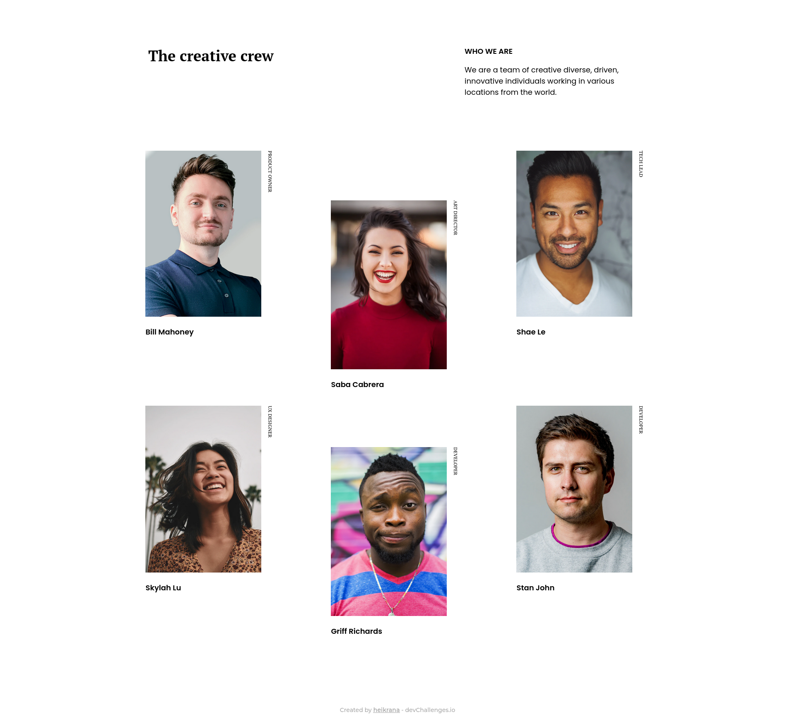

<h1 align="center">My Team Page</h1>

   Solution for a challenge from  <a href="http://devchallenges.io" target="_blank">Devchallenges.io</a>.

  <h3>
    <a href="https://heikrana.github.io/devchallenges-myTeamPage/">
      Demo
    </a>
     | 
    <a href="https://github.com/Heikrana/devchallenges-myTeamPage">
      Solution
    </a>
     | 
    <a href="https://devchallenges.io/challenges/hhmesazsqgKXrTkYkt0U">
      Challenge
    </a>
  </h3>

## Table of Contents

-   [Screenshot](#screenshot)
-   [Features](#features)
-   [Contact](#contact)

## Screenshot

### Built With

-   HTML5
-   Vanilla CSS

## Contact

-   Website [Work in Progress](https://heikrana.github.io/devchallenges-404NotFound/)
-   Twitter [@heikrana](https://twitter.com/heikrana)
-   Linkedin [@heikrana](https://linkedin.com/in/heikrana)
